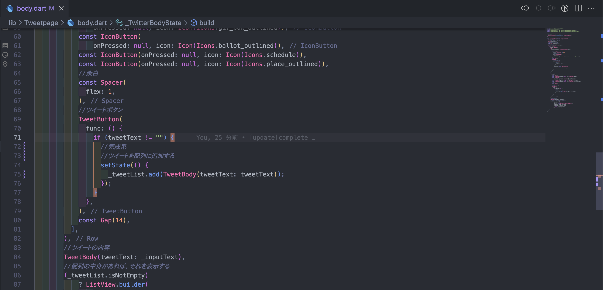

# watnowモバイルアプリ開発体験会用(Flutter)

このレポジトリは2023年新入生向けコンテンツとして作成されました。

作成者 藤沢

## 担当者

flutterを触ったことがある人。

## フォルダ構造

- lib
  - main.dart
  - appbar.dart
  - bottomnavigation.dart
  - Tweetpage
    - body.dart
    - widgets
      - tweet.dart
      - tweetbutton.dart

# 変数の役割

`_inputText`入力された文字を一時的に保存する変数。これはonChanged(入力されるたびに発火する関数)内で更新しているため、文字が入力されるたびに更新される。
`tweetText`変数`_inputText`から文字を受け取り、その文字を

# 環境構築について

## 1. flutterのインストール

以下参照

> https://www.sejuku.net/blog/123973

## 2. このレポジトリのクローン

> `git clone (パス名)`

その後、vscodeで開く

\*開きたいファイルに移動してターミナルに`code .`と入力するとvscodeが起動するよ

## 3.パッケージのインストール

クローンしただけだと、パッケージがインストールされてなく、大量にエラーが出ていると思われます。そのエラーはパッケージがインストールされていないことが原因なので、インストールしてあげましょう。ターミナルに `flutter pub get`と入力するとパッケージがインストールされます。

## 4.起動

`flutter run`とターミナルに入力してアプリを起動させましょう。

# 教え方について

## ゴール

ツイートをするとそのツイートが下に追加されるようにする

## 初期状態

1.文字を入力されたタイミングで`onChanged`関数で文字を`_inputText`に保存。

2.`ツイートする`ボタンが押されると、setState内で`_inputText`に一時的に保存されている文字が`tweetText`に代入され、1つ目のツイートのテキストに反映される。

## 完成系

1.文字を入力されたタイミングで`onChanged`で文字を`_inputText`に保存。2.`ツイートする`ボタンが押されると、setState内で`_tweetList`配列に入力内容を追加し、画面上ににツイートが増えていくようにする。

## フロー

初期状態では変数`tweetText`に文字を代入しているだけで、ツイートを一つしか格納することができない。

そこで配列を使って複数のツイートを格納するようにする。

そこで、あらかじめ用意されている`_tweetList`配列に追加することで複数のツイートを格納することができる。

初期状態

完成系

## 教えること

配列と変数の違い、その扱い方。

## setStateについて

今回setStateを使いツイートの流れを実装したが、流石に新入生に対して状態管理を教えるわけにはいかないので、できるだけスルーして欲しい（おまじない的な）。
